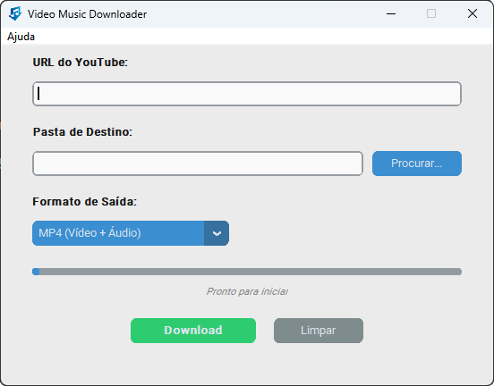

# 🎬 Video Music Downloader (VMD)



---


O **Video Music Downloader** é uma aplicação desktop moderna e intuitiva desenvolvida em Python para o sistema operacional Windows. O objetivo principal do projeto é permitir o download rápido de vídeos (MP4) e áudios (MP3) do YouTube diretamente para o computador, sem a necessidade de instalar dependências complexas como o FFmpeg de forma manual.

---

## ✨ Funcionalidades

* **Download Híbrido:** Escolha entre baixar o vídeo completo em alta resolução (`.mp4`) ou apenas a faixa de áudio (`.mp3`).
* **Proteção e PO Token (Proof of Origin):** Suporte nativo ao PO Token do YouTube para contornar bloqueios de bot, com geração automática via BotGuard (Node.js) e interface para inserção de tokens manuais.
* **Interface Moderna:** Desenvolvida com `CustomTkinter`, oferecendo suporte nativo ao Modo Escuro/Claro (Dark/Light Mode) baseado nas configurações do seu Windows.
* **Conversão Inteligente:** Extrai e renomeia o fluxo de áudio nativo sem engasgar e sem travar a interface.
* **Download em Segundo Plano (Threading):** A barra de progresso e a interface gráfica continuam fluidas e responsivas enquanto o download acontece em paralelo.
* **Diretório Inteligente:** Cria automaticamente uma pasta dedicada na sua Área de Trabalho (`Desktop/Downloads_Midia`) caso nenhuma pasta seja selecionada.

---

## 🛠️ Tecnologias Utilizadas

O projeto foi construído utilizando as seguintes bibliotecas do ecossistema Python:

* **[CustomTkinter](https://github.com/TomsOpts/CustomTkinter):** Evolução da biblioteca nativa Tkinter, utilizada para criar o design moderno e arredondado dos componentes visuais.
* **[Pytubefix](https://github.com/JuanBindez/pytubefix):** Biblioteca robusta e atualizada para interagir com a API do YouTube, com suporte a PO Tokens e client WEB.
* **Threading (Nativa):** Módulo utilizado para assincronismo, evitando o congelamento da janela durante o download de arquivos pesados.
* **Webbrowser (Nativa):** Utilizada para injetar o comportamento de link clicável que redireciona o usuário para o repositório do GitHub e documentações.

---

## 🚀 Como Executar o Projeto Localmente

### Pré-requisitos
Certifique-se de ter o **Python 3.10 ou superior** instalado em sua máquina.

### Passo a Passo

1.  **Clonar o Repositório:**
    ```bash
    git clone https://github.com/fhricardo/video-music-downloader.git
    cd video-music-downloader
    ```

2.  **Criar e Ativar o Ambiente Virtual:**
    ```bash
    python -m venv .venv
    # No Windows (Prompt de Comando):
    .venv\Scripts\activate
    ```

3.  **Instalar as Dependências:**
    ```bash
    pip install -r requirements.txt
    ```

4.  **Iniciar a Aplicação:**
    ```bash
    python app.py
    ```

---

## 🛡️ Sobre o PO Token (Proof of Origin)

O YouTube recentemente começou a exigir um **PO Token** gerado pelo BotGuard para autenticar clientes e prevenir requisições automatizadas/robôs. 

- **Geração Automática (Padrão):** O aplicativo utiliza o cliente `WEB` do `pytubefix` em conjunto com `nodejs-wheel-binaries` para gerar os tokens de autenticação automaticamente em segundo plano.
- **Configuração Manual:** Caso precise fornecer seu próprio PO Token e `visitorData` extraídos do navegador, basta acessar no menu do aplicativo: **Configurações > Configurar PO Token (YouTube)...** e preencher os campos.

---

## 📦 Compilação para Executável (.exe)

Caso queira gerar um arquivo executável para rodar no Windows de forma portátil (sem precisar do terminal ou do Python instalado), você pode compilar o projeto utilizando o **PyInstaller**.

1. Instale o PyInstaller no seu ambiente virtual:
```bash
pip install pyinstaller
```

2. Execute o comando de compilação utilizando o arquivo de especificações (`Video Music Downloader.spec`):
```bash
pyinstaller "Video Music Downloader.spec"
```

3. Após o término do processo, a pasta **`dist/`** conterá o executável pronto para distribuição.

---

## 👨‍💻 Autor

Desenvolvido com 💻 por **Flávio Ricardo**.

* **GitHub:** [@fhricardo](https://github.com/fhricardo)
* **Projeto Original:** [Video Music Downloader](https://github.com/fhricardo/video-music-downloader)

---

## 📄 Licença

Este projeto está sob a licença MIT. Consulte o arquivo `LICENSE` para obter mais detalhes.